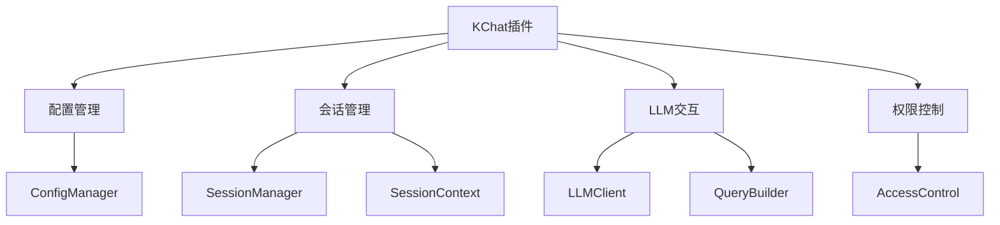
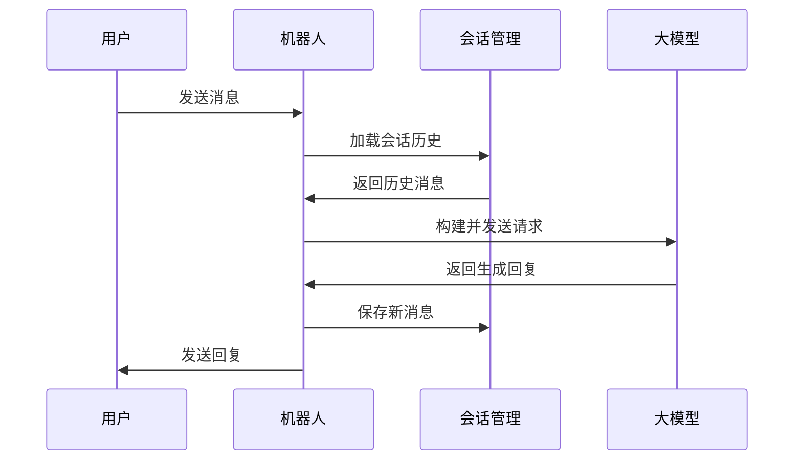

# KChat 插件文档

## 项目概述

KChat 是一个基于 NoneBot 的 QQ 聊天机器人插件，主要功能是模拟角色"宵崎奏"进行群聊和私聊对话。插件使用大模型 API 生成符合角色设定的回复，并提供了完整的会话管理和权限控制功能。

## 项目架构



## 核心模块说明

### 1. 配置管理 (ConfigManager)

<mcsymbol name="ConfigManager" filename="config_manager.py" path="src/plugins/KChat/config/config_manager.py" startline="121" type="class"></mcsymbol>

- 负责加载和管理插件配置
- 支持配置热更新和备份恢复
- 主要配置文件: <mcfile name="app_settings.yaml" path="src/plugins/KChat/config/app_settings.yaml"></mcfile>

配置项示例:
```yaml
access_control:
  admin_id: [1985489768]
  group:
    enable_whitelist: true
    whitelist: [216295809]
    
llm_api:
  api_url: https://openrouter.ai/api/v1/chat/completions
  model: google/gemma-3-27b-it
```

### 2. 会话管理 (SessionManager)

<mcsymbol name="SessionManager" filename="session_manager.py" path="src/plugins/KChat/session_context/session_manager.py" startline="154" type="class"></mcsymbol>

- 管理聊天会话的创建、加载和保存
- 支持群聊和私聊两种会话类型
- 会话数据存储在 JSON 文件中
- 会话历史记录最大数量可配置

示例会话文件: <mcfile name="group_216295809.json" path="src/plugins/KChat/session_context/sessions/group_216295809.json"></mcfile>

### 3. LLM 交互模块

#### LLMClient

<mcsymbol name="LLMClient" filename="llm_client.py" path="src/plugins/KChat/llm_api/llm_client.py" startline="25" type="class"></mcsymbol>

- 负责与大模型 API 的交互
- 处理请求和响应
- 支持超时和重试机制

#### QueryBuilder

<mcsymbol name="QueryBuilder" filename="query_builder.py" path="src/plugins/KChat/llm_api/query_builder.py" startline="119" type="class"></mcsymbol>

- 构建符合大模型要求的请求数据
- 加载系统提示词和角色设定
- 支持消息类型过滤 (text, mface, image)

### 4. 权限控制

- 基于配置文件的白名单/黑名单机制
- 支持群聊和私聊的独立权限设置
- 管理员拥有特殊权限

## 数据流



## 角色设定

角色设定文件: <mcfile name="kanade.yaml" path="src/plugins/KChat/prompt/character/kanade.yaml"></mcfile>

包含:
- 角色名称和别名
- 背景故事
- 技能描述
- 与其他角色的关系

## 部署要求

1. Python 3.8+
2. NoneBot 2.x
3. 依赖库:
   - aiohttp
   - pyyaml
   - nonebot-plugin-localstore

## 使用示例

1. 群聊交互:
```
用户: 奏，你的泡面能分我一点吗？
机器人: ...别、别这样啦(>_<) 我真的只有一桶泡面了...
```

2. 私聊交互:
```
用户: 你好
机器人: 你好...(小声)
```

## 扩展性

1. 可通过修改角色设定文件自定义角色行为
2. 支持更换不同的大模型服务
3. 可扩展新的消息类型处理

## 目录结构

```
KChat/
├── config/                  # 配置相关
│   ├── app_settings.yaml    # 主配置文件
│   └── config_manager.py    # 配置管理
├── llm_api/                 # 大模型交互
│   ├── llm_client.py        # API客户端
│   ├── query_builder.py     # 请求构建
│   └── last_queries/        # 请求日志
├── prompt/                  # 提示词
│   ├── character/           # 角色设定
│   └── system/              # 系统提示词
├── session_context/         # 会话管理
│   ├── session_manager.py   # 会话管理器
│   └── sessions/            # 会话数据
└── logger.py                # 日志配置
```

## 注意事项

1. API key 等敏感信息应妥善保管
2. 定期备份会话数据
3. 监控大模型 API 的使用情况以避免超额